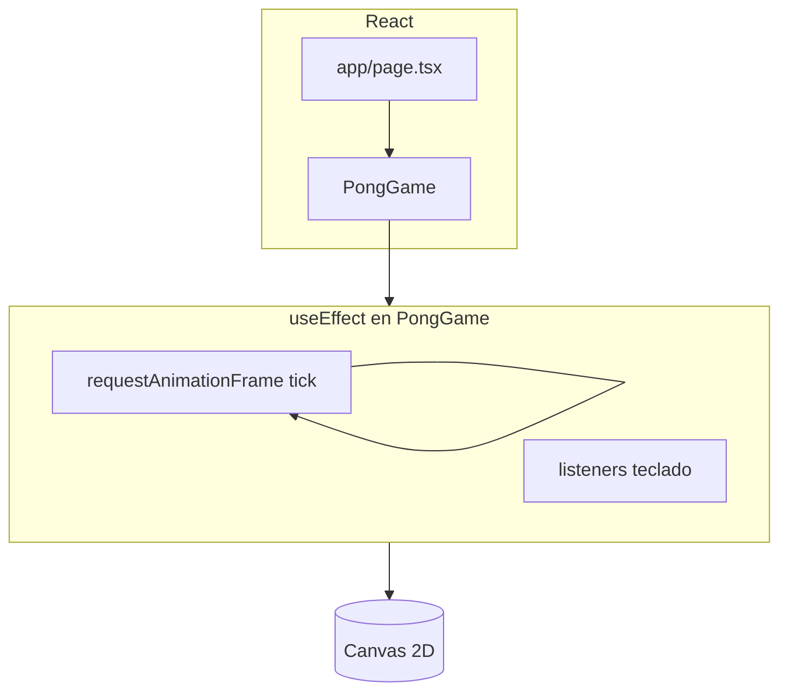

# game-01 — Pong en Next.js

Pong clásico en el navegador: dos paletas, una pelota, marcador y varios modos. Está hecho con **Next.js** (App Router), **React 19**, **TypeScript** y **Canvas 2D**, sin motor de juegos ni dependencias extra.

## Cómo ejecutarlo

```bash
npm install
npm run dev
```

Abre [http://localhost:3000](http://localhost:3000). El juego ocupa la página principal.

```bash
npm run build   # compilación de producción
npm run start   # sirve el build
npm run lint    # ESLint
```

## Objetivo del juego

- La **pelota** rebota en el techo y el suelo y en las paletas.
- Si la pelota sale por la **izquierda**, anota el jugador / CPU de la **derecha**; si sale por la **derecha**, anota la **izquierda**.
- Tras cada punto hay **saque** desde el centro hacia el bando del que no anotó.
- La **velocidad de la pelota** empieza baja y **sube cada pocos segundos** hasta un máximo (para partidas que se intensifican con el tiempo).

## Controles

### Un jugador (vs CPU)

| Acción | Teclas |
|--------|--------|
| Subir paleta izquierda | **W** o **↑** |
| Bajar paleta izquierda | **S** o **↓** |

La paleta derecha la mueve la **IA**. Las flechas mueven la misma paleta que W/S.

### Dos jugadores

| Jugador | Lado | Subir | Bajar |
|---------|------|-------|-------|
| 1 | Izquierda | **W** | **S** |
| 2 | Derecha | **↑** | **↓** |

En 2 jugadores las flechas **solo** controlan la derecha, para no chocar con el jugador 1.

Los eventos son `keydown` / `keyup` en `window`. El estado de teclas va en un **`useRef`** para no re-renderizar React a ~60 Hz. En `keydown` se usa **`preventDefault()`** en esas teclas para limitar el scroll de la página.

## Modos de juego

Hay **dos opciones independientes** (se pueden combinar). Al cambiar cualquiera se **reinicia** la partida: marcador a cero, pelota al centro, teclas limpias y bucle del juego recreado.

### Jugadores

| Modo | Descripción |
|------|-------------|
| **1 jugador** | Tú a la izquierda; la derecha sigue la pelota con velocidad `PADDLE_SPEED * 0.85` (un poco más lenta que tú). |
| **2 jugadores** | Dos humanos; no hay IA. |

### Paletas

| Modo | Descripción |
|------|-------------|
| **Paletas fijas** | Ambas miden `PADDLE_H` px de alto. |
| **Paletas al azar** | Cada paleta tiene altura propia, entera, entre `PADDLE_H_MIN` y `PADDLE_H_MAX`. Se vuelve a sortear al activar el modo, **cada `PADDLE_RANDOM_MS` ms** durante el rally y **al anotar** (junto con el saque). Las posiciones verticales se ajustan para que ninguna paleta quede fuera del campo. |

## Velocidad de la pelota (rampa)

- Tras cada **saque** (inicio o punto), la magnitud de la velocidad vuelve a **`BALL_SPEED_INITIAL`** (lenta).
- Cada **`BALL_SPEED_RAMP_MS`** milisegundos sube en **`BALL_SPEED_STEP`** hasta **`BALL_SPEED_MAX`**.
- Al subir la magnitud se **reescala** el vector `(vx, vy)` para mantener la **dirección**.

## Constantes (balance)

Definidas al inicio de `components/PongGame.tsx`. Ajusta y prueba con `npm run dev`.

### Tablero y piezas

| Constante | Por defecto | Efecto |
|-----------|-------------|--------|
| `W`, `H` | 640 × 360 | Resolución interna del `<canvas>` (el CSS puede escalarlo). |
| `PADDLE_W` | 12 | Ancho de las paletas. |
| `PADDLE_H` | 72 | Alto con **Paletas fijas**. |
| `BALL` | 10 | Diámetro de la pelota (colisiones usan radio `BALL / 2`). |
| `PADDLE_SPEED` | 4 | Movimiento de paletas por frame (humano e IA). |

### Paletas al azar

| Constante | Por defecto | Efecto |
|-----------|-------------|--------|
| `PADDLE_H_MIN` | 36 | Altura mínima sorteable. |
| `PADDLE_H_MAX` | 120 | Altura máxima sorteable (debe caber en `H`). |
| `PADDLE_RANDOM_MS` | 4500 | Intervalo entre re-sorteos de altura. |

### Velocidad de la pelota

| Constante | Por defecto | Efecto |
|-----------|-------------|--------|
| `BALL_SPEED_INITIAL` | 2.2 | Magnitud tras cada saque. |
| `BALL_SPEED_MAX` | 7.5 | Tope de magnitud. |
| `BALL_SPEED_STEP` | 0.45 | Incremento por escalón del temporizador. |
| `BALL_SPEED_RAMP_MS` | 4000 | Ms entre escalones. |

### IA

El factor **`0.85`** sobre `PADDLE_SPEED` para la paleta derecha está en el bucle `tick` de `PongGame.tsx`; puedes extraerlo a una constante (por ejemplo `AI_PADDLE_FACTOR`) para tunear la dificultad.

### Ideas de tuning

- Partidas más largas antes de acelerar: bajar `BALL_SPEED_STEP` o subir `BALL_SPEED_RAMP_MS`.
- Más caos en paletas: acortar `PADDLE_RANDOM_MS` o ampliar el rango de alturas (sin superar la altura del campo).

## Arquitectura del código



| Archivo | Rol |
|---------|-----|
| [`components/PongGame.tsx`](components/PongGame.tsx) | Lógica del juego, canvas, botones de modo y comentarios por secciones. |
| [`app/page.tsx`](app/page.tsx) | Página que monta `<PongGame />`. |
| [`app/layout.tsx`](app/layout.tsx) | Layout raíz y metadatos (título “Pong”, etc.). |

**Por qué casi no hay `useState` para la simulación:** la posición de la pelota y las paletas cambian cada frame (~60/s). Guardarlas en `useState` forzaría re-renders de React constantes; el canvas ya se pinta con la API imperativa (`fillRect`, `arc`, …). Por eso el estado de juego son variables `let` dentro de `useEffect`, y solo **`twoPlayers`** y **`randomPaddles`** son `useState` (cambian poco y actualizan la UI de botones y el texto de ayuda).

**Orden dentro de cada frame (`tick`):** temporizadores (paletas al azar, rampa de velocidad) → entrada → IA (si 1 jugador) → movimiento de la pelota y rebotes techo/suelo → colisiones con paletas → puntos y `resetBall` → dibujo.

**Coordenadas:** origen arriba-izquierda; `leftY` / `rightY` son el borde superior de cada paleta; la pelota usa el centro (`ballX`, `ballY`).

## Stack técnico

- [Next.js](https://nextjs.org/) 16 (App Router)
- React 19 (`"use client"` en el componente del juego)
- TypeScript
- Tailwind CSS 4 (estilos de la página y botones)
- Fuente [Geist](https://vercel.com/font) vía `next/font`

## Wiki adicional

En [`docs/wiki/`](docs/wiki/README.md) hay las mismas temáticas repartidas en páginas cortas (controles, modos, arquitectura, constantes) por si prefieres leer por capítulos.

## Despliegue

Puedes desplegar en [Vercel](https://vercel.com/new) u otro hosting compatible con Next.js. Consulta la [documentación de despliegue de Next.js](https://nextjs.org/docs/app/building-your-application/deploying).

## Accesibilidad

El juego depende del **teclado**. Ampliar a ratón, tactil o gamepad implicaría mapear a la misma lógica de movimiento de paletas.
