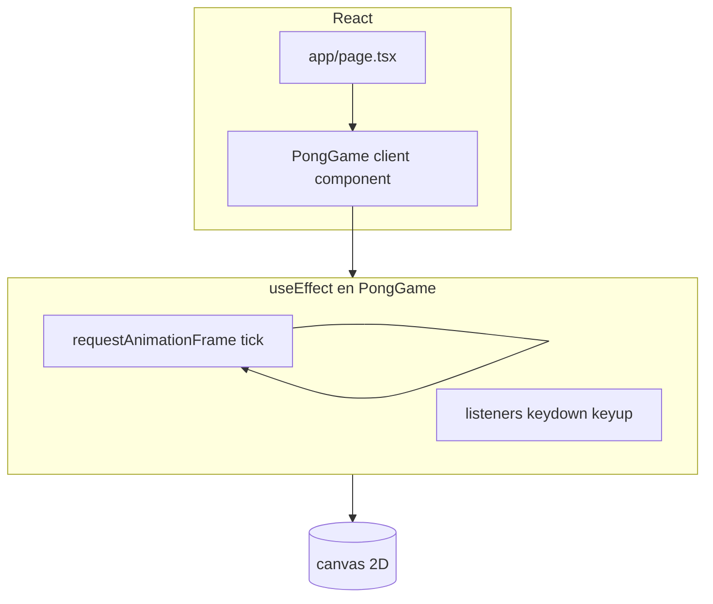

# Arquitectura y código

## Vista de alto nivel

- **`app/page.tsx`**: página mínima que renderiza `<PongGame />`.
- **`components/PongGame.tsx`**: toda la lógica del juego y la UI de botones.

## Por qué el estado del juego no está en `useState`

La simulación avanza **cada frame** (~60 Hz). Si guardáramos posición de la pelota o paletas en `useState` y actualizáramos en cada `tick`, React intentaría re-renderizar el árbol a esa frecuencia, lo cual es innecesario: el canvas se dibuja con la API imperativa (`ctx.fillRect`, etc.), no con JSX por píxel.

En su lugar:

- Variables `let` dentro del `useEffect` mantienen posiciones, velocidades, marcador y alturas de paleta.
- Solo **`twoPlayers`** y **`randomPaddles`** son `useState`**, porque cambian poco y deben actualizar la UI de botones y el texto de ayuda.

## Ciclo de vida del efecto

1. Al montar (o al cambiar `twoPlayers` / `randomPaddles`), se obtiene `CanvasRenderingContext2D`, se reinician teclas y se inicializan variables del juego.
2. Se define `resetBall` y se llama una vez para el primer saque.
3. `tick` se programa con `requestAnimationFrame`.
4. En limpieza del efecto: `cancelAnimationFrame` y `removeEventListener` para no filtrar listeners ni frames tras desmontar o cambiar de modo.

## Orden lógico dentro de `tick`

1. Temporizadores: re-sorteo de paletas (modo al azar), subida de `ballSpeed`.
2. Entrada humana → mover `leftY` (y `rightY` si hay dos jugadores).
3. IA → mover `rightY` si solo hay un jugador.
4. Integrar posición de la pelota; rebote techo/suelo.
5. Colisiones con paletas (ajuste de `ballX` y signo de `vx`).
6. Puntos si la pelota sale por los costados → `resetBall`.
7. Dibujar todo el frame.

## Coordenadas

- Origen **arriba-izquierda** del canvas.
- `leftY` / `rightY` son el **borde superior** de cada paleta; la altura efectiva es `leftPh` o `rightPh`.
- La pelota usa el **centro** (`ballX`, `ballY`) y radio `BALL / 2`.

## Archivos relacionados

| Archivo | Rol |
|---------|-----|
| `components/PongGame.tsx` | Juego completo |
| `app/page.tsx` | Punto de entrada visual |
| `app/layout.tsx` | Metadatos globales (título, etc.) |
